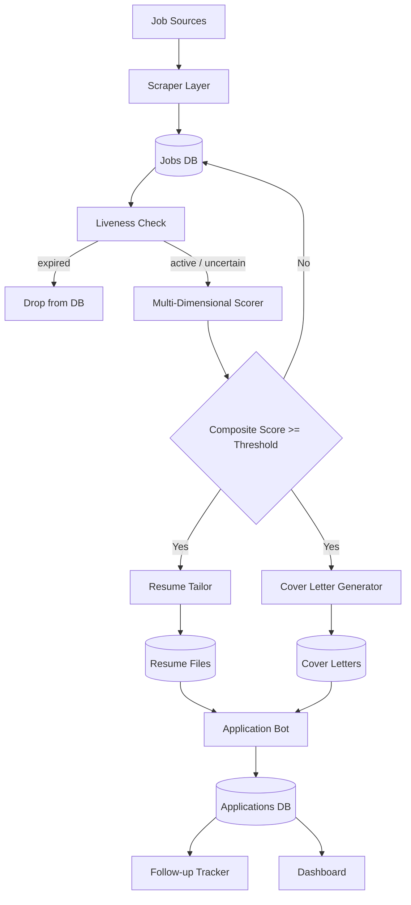

# Remote Job Auto-Apply MVP (Python)

A **local automation pipeline** that discovers remote jobs, validates them with structured AI scoring, generates tailored application materials, and tracks follow-ups — all with safe defaults.

> Compliance-first: no login scraping required, dry-run submission enabled, daily application cap.

## How it works



## Structured output pipeline

Every AI step returns a validated Pydantic model. Malformed or incomplete model output raises a `ValidationError` immediately — no silent failures.

| Step | Schema | Validated fields |
|------|--------|-----------------|
| Job scoring | `JobRelevanceResult` | `role_match`, `level_fit`, `growth_potential`, `remote_alignment` (each 0–1), computed `score` (1–10) |
| Cover letter | `CoverLetter` | `opening`, `body`, `closing` |
| Resume tailoring | `TailoredResume` | `summary`, `skills[]`, `experience[]`, `education[]` |
| Liveness check | `LivenessResult` | `status` (active / expired / uncertain), `reason` |

### Scoring breakdown

The composite score is computed deterministically from four LLM-returned sub-scores:

```
score = round((role_match × 0.45 + level_fit × 0.30 + growth_potential × 0.15 + remote_alignment × 0.10) × 10)
```

The LLM scores the dimensions; the weights and arithmetic live in your code, not the prompt.

## Folder structure

```text
remote-job-autoapply-mvp/
├── .env.example
├── requirements.txt
├── app.py              # orchestration pipeline
├── config.py
├── db.py               # SQLAlchemy models (Job, Application)
├── models.py           # Pydantic models for scraper output
├── dashboard.py        # Streamlit tracker
├── data/
│   ├── candidate_profile.txt
│   └── master_resume.txt
├── ai/
│   ├── client.py
│   ├── schemas.py      # all structured output models
│   ├── scorer.py       # multi-dimensional relevance scoring
│   ├── resume_tailor.py
│   └── cover_letter.py
├── scrapers/
│   ├── liveness.py     # posting freshness check
│   ├── linkedin.py
│   ├── remoteok.py
│   ├── weworkremotely.py
│   └── company_pages.py
└── automator/
    └── apply_playwright.py
```

## Dependencies

- `requests` + `beautifulsoup4` — scraping and liveness checks
- `SQLAlchemy` + `SQLite` — persistence
- `openai` — structured output via `beta.chat.completions.parse`
- `pydantic` — schema validation for all AI outputs
- `playwright` — browser automation for form submission
- `streamlit` + `pandas` — local tracking dashboard
- `python-dotenv` — local config

## Run locally

### Step 1 — Setup

```bash
cd experiments/local-ai/remote-job-autoapply-mvp
python3 -m venv .venv
source .venv/bin/activate
pip install -r requirements.txt
playwright install chromium
cp .env.example .env
```

### Step 2 — Add personal inputs

```
data/candidate_profile.txt   ← your background, skills, preferences
data/master_resume.txt       ← base resume text
```

### Step 3 — Run pipeline

```bash
python app.py
```

The pipeline will:

1. Scrape jobs from configured sources
2. Check each posting for liveness — expired listings are dropped before any AI calls
3. Score live jobs across four dimensions; print sub-scores to stdout
4. Generate tailored resume + cover letter for jobs above the threshold
5. Attempt dry-run form submission
6. Record applications with a follow-up date (7 days out)
7. Print any follow-ups that are due

### Step 4 — View dashboard

```bash
streamlit run dashboard.py
```

## Configuration

| Env var | Default | Purpose |
|---------|---------|---------|
| `OPENAI_API_KEY` | — | Required |
| `OPENAI_MODEL` | `gpt-4o-mini` | Model used for all AI steps |
| `MIN_RELEVANCE_SCORE` | `7` | Minimum composite score (1–10) to proceed |
| `MAX_APPLICATIONS_PER_DAY` | `5` | Daily cap |

## Safe-by-default compliance

- Uses public job pages and APIs only — no login scraping.
- `dry_run=True` by default; the bot fills forms but does not submit.
- Daily application cap via `MAX_APPLICATIONS_PER_DAY`.
- Liveness check prevents touching closed postings.
- Manual review strongly recommended before enabling live submission.

## Scaling ideas

1. Multi-tenant PostgreSQL + row-level security
2. Queue workers (Celery/RQ) for parallel scrape/score/apply
3. Provider abstraction for multiple LLM backends
4. Human approval inbox before submission
5. ATS adapters (Greenhouse, Lever, Workday) with site-specific selectors
6. Conversion analytics by source, role, and company

## Notes

- LinkedIn/ATS policies evolve; validate terms before enabling real submissions.
- The liveness check uses pattern matching and HTTP status — it catches most expired postings but is not exhaustive.
